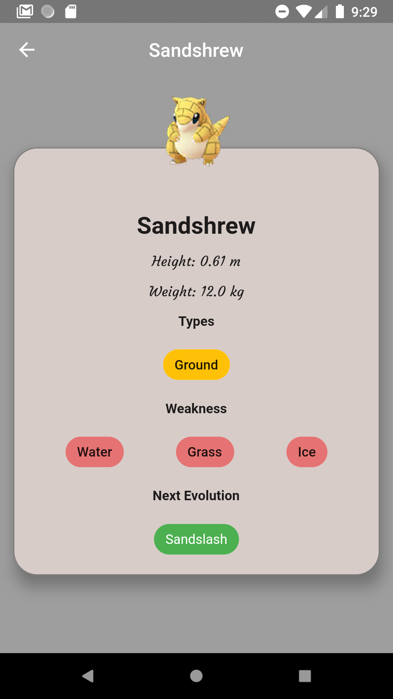

# Pokemon Go Poke Desk for pokemon details

PokeDex Application

<i>Screenshot of the application</i>

 

This project is a starting point for a Flutter application.

A few resources to get you started if this is your first Flutter project:

